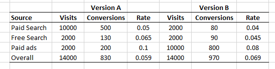

```{r setup, include=FALSE}
knitr::opts_chunk$set(echo = TRUE,
                      cache = TRUE, 
                      warning = FALSE,
                      message = FALSE)
```

1. Suppose that before we conducted a study to compare versions A and B, we knew we'd do a subgroup analysis, with one subgroup for viewed from email and another for viewed by Internet.  We expected to get 50 observations  for email and 271 of each version for Internet.  Based on experience, we knew the standard deviation of each subgroup to be 30.  What is the power for each subgroup if we wish to detect a difference of \$5? \$10? \$15?  Comment on the power of each subgroup.

# Email

```{r}

#A
power.t.test(n=50, delta=5, sd=30, sig.level=0.05, power = NULL)

#B
power.t.test(n=50, delta=10, sd=30, sig.level=0.05, power = NULL)

#C
power.t.test(n=50, delta=15, sd=30, sig.level=0.05, power = NULL)

```
* A: The power would be 0.12 for this test and there would be a 88% probability that we decided there is no difference when there actually is a difference of $5 in sales between the two groups.
* B: The power would be 0.38 for this test and there would be a 62% probability that we decided there is no difference when there actually is a difference of $10 in sales between the two groups.
* C: The power would be 0.69 for this test and there would be a 31% probability that we decided there is no difference when there actually is a difference of $15 in sales between the two groups.

# Internet

```{r}

#D
power.t.test(n=271, delta=5, sd=30, sig.level=0.05, power = NULL)

#E
power.t.test(n=271, delta=10, sd=30, sig.level=0.05, power = NULL)

#F
power.t.test(n=271, delta=15, sd=30, sig.level=0.05, power = NULL)

```

* D: The power would be 0.49 for this test and there would be a 51% probability that we decided there is no difference when there actually is a difference of $5 in sales between the two groups.
* E: The power would be 0.97 for this test and there would be a 3% probability that we decided there is no difference when there actually is a difference of $10 in sales between the two groups.
* F: The power would be 0.99 for this test and there would be a 1% probability that we decided there is no difference when there actually is a difference of $15 in sales between the two groups.

The file "ttvariables.csv" contains 1000 observations on each of 23 variables.  Y is a response variable corresponding to an experiment on X where 0 denotes control and 1 denotes treatment. Use this file to answer the following questions.   

1. Read in the data and find the mean and standard deviation for Y at each value of X. 

```{r}
df <- read.csv("/Users/jacobigel/Desktop/School/ISA365-A/Datasets/ttvariables.csv", stringsAsFactors = TRUE)

head(df)

```

```{r}
library(dplyr)
library(magrittr)

df %>% group_by(X) %>% summarise(mean(Y), sd(Y), n())
```

2. The treatment had no effect.  Perform a test to verify this.

```{r}

t.test(df$Y~df$X)

```

3. The variables Z1 through Z10 are binary covariates. Change them so they are correctly coded in r.

```{r}

df$Z1 <- as.factor(df$Z1)
df$Z2 <- as.factor(df$Z2)
df$Z3 <- as.factor(df$Z3)
df$Z4 <- as.factor(df$Z4)
df$Z5 <- as.factor(df$Z5)
df$Z6 <- as.factor(df$Z6)
df$Z7 <- as.factor(df$Z7)
df$Z8 <- as.factor(df$Z8)
df$Z9 <- as.factor(df$Z9)
df$Z10 <- as.factor(df$Z10)

```


4. Test to see if any of these covariates has a significant effect.  You will have to perform two tests per variable, one for the "1" group and one for the "0" group. Do this for each covariate Z1 through Z10. Hint: I would use `filter()` from tidyverse to make small little datasets and then perform the t.tests.

# Group 1

```{r}
library(tidyverse)

df1 <- filter(df, Z1 == 1)
t.test(df1$Y ~ df1$X)

df2 <- filter(df, Z2 == 1)
t.test(df2$Y ~ df2$X)

df3 <- filter(df, Z3 == 1)
t.test(df3$Y ~ df3$X)

df4 <- filter(df, Z4 == 1)
t.test(df4$Y ~ df4$X)

df5 <- filter(df, Z5 == 1)
t.test(df5$Y ~ df5$X)

df6 <- filter(df, Z6 == 1)
t.test(df6$Y ~ df6$X)

df7 <- filter(df, Z7 == 1)
t.test(df7$Y ~ df7$X)

df8 <- filter(df, Z8 == 1)
t.test(df8$Y ~ df8$X)

df9 <- filter(df, Z9 == 1)
t.test(df9$Y ~ df9$X)

df10 <- filter(df, Z10 == 1)
t.test(df10$Y ~ df10$X)

```

# Group 0

```{r}
library(tidyverse)

df01 <- filter(df, Z1 == 0)
t.test(df01$Y ~ df01$X)

df02 <- filter(df, Z2 == 0)
t.test(df02$Y ~ df02$X)

df03 <- filter(df, Z3 == 0)
t.test(df03$Y ~ df03$X)

df04 <- filter(df, Z4 == 0)
t.test(df04$Y ~ df04$X)

df05 <- filter(df, Z5 == 0)
t.test(df05$Y ~ df05$X)

df06 <- filter(df, Z6 == 0)
t.test(df06$Y ~ df06$X)

df07 <- filter(df, Z7 == 0)
t.test(df07$Y ~ df07$X)

df08 <- filter(df, Z8 == 0)
t.test(df08$Y ~ df08$X)

df09 <- filter(df, Z9 == 0)
t.test(df09$Y ~ df09$X)

df010 <- filter(df, Z10 == 0)
t.test(df010$Y ~ df010$X)


```


5. Which subgroups show an effect?

* df4: The ones group in Z4
* df07: The zero group in Z7


6. What is the probability that at least one of those tests is a type I error?

```{r}

1 - .95^20

```

7. The variables Z11-Z20 are continuous. The first step is to determine possible cut off values.  It might be helpful to make a histogram of the variable to see if there are some "natural" groups. Make a histogram of Z11. 

```{r}

hist(df$Z11)

```

8. Let's break down Z11 into three groups, 0<0.2, 0.2<Z11<0.8 and Z11>0.8.  Then we will use those groups and preform a t-test for each group. There is code below. Explain what the first three lines of code are doing.  Then write your conclusion about the subgroups.

```{r}

A<-(df$Z11< 0.2)
B<- (df$Z11 > 0.2) & (df$Z11 <.8)
C<- (df$Z11 > 0.8)
t.test(df$Y[A]~df$X[A])
t.test(df$Y[B]~df$X[B])
t.test(df$Y[C]~df$X[C])

```

* The first three lines of code are selecting 1) anything from Z11 that is less than .2, 2) anything from Z11 that are between .2 and .8 but not including .2 and .8, and 3) anything from Z11 that is above .8.
* We can see that from all three of these tests that even with Z11 broken up into three groups, there is no significance between Y and X in terms of Z11.

9. Let's say we tested and in addition to the tests you ran in number 4 we found 5 other significant effects. How many of those results are real treatment effects as opposed to false positives? How would we know which is which?


* Well we would have to determine if some of those tests are falsely positive based on if they are casual with each other or not. We could determine about how many of those results are real treatment effects based on how we calculate our type I error rates.


10. The conversion rate of a webpage is the proportion of visitors who have action on a webpage, i.e. the user does not just view the page and leave, he interacts with the page.  A website landing page may have many sources, e.g. paid search, unpaid search, paid ads, etc.  You have conducted an A/B test for two versions of a landing page, and you wish to determine which version has more conversions.  Your programmer misinterpreted your instructions, and rather than show different versions to each successive customer, he ran version A on one day and version B the next day.  Each page got 14000 visits.  Version A has 830 conversions, while version B has 970 conversions.  Is this result significant?  Which version is best?  What is your recommendation?

```{r}

prop.test( x = c(830, 970), n = c(14000, 14000))

```

# INCORRECT
* From this test that we preformed, we can see that this result is significant and that version B is the best. My recommendation is to continue using version B since it saw the most conversion rate on the webpage. 

# CORRECT
* This test is not valid to use due to the way the experiment is designed - cannot tell if it was the day or it was B.


11. Your boss, who is an MU grad, calls you into his office. He has checked the source of the referrals to the landing page. He shows you the following:




"So version A does better on each source, but does worse overall?  What is the meaning of this?  Should we implement version A or version B?".  How do you answer your boss?


* Well boss, even though we can see from the whole data set that A does better on each source but if we are wanting to predict what would be better for us in the long term, we would want to choose version B. 
* Simpsons paradox! There is a lurking variable. 