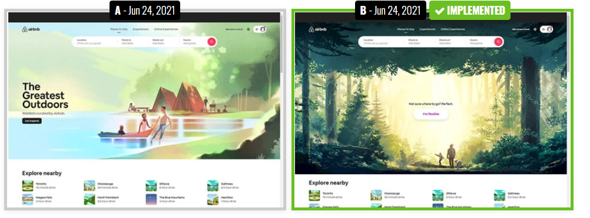

```{r setup, include=FALSE}
knitr::opts_chunk$set(echo = TRUE,
                      cache = TRUE, 
                      warning = FALSE,
                      message = FALSE)

library(tidyverse)
```


1. Refer to the CarsData.csv used in the notes. Suppose each observation costs $10,000.  How much did the Latin Squares Design without replication cost?  How much did the Latin Squares design with replication cost?  How much would a completely randomized design (CRD) cost?

* Without replication cost: (9 * 10000) = $90,000
* With replication cost: (18 * 10000) = $180,000
* CRD Cost: (3 * 3 * 3) * 10000 = $270,000
--> FUEL TYPE, CAR TYPE, SPEED = 3 * 3 * 3

A company wishes to test the market for a new snack.  Two factors are of interest: the advertising campaign and the product description on the package.  Four types of campaigns are considered, and four different descriptions are considered. The various test campaigns were conducted in four cities, 1, 2, 3, and 4.  Sales in thousands of dollars were recorded. See page 187 in your test for a description of the factor levels. The data is contained in the "snacks.csv" file.  Note, the most common use of an LSD is with two blocking factors, but this does not necessarily have to be the case. 

```{r}

snacks <- read.csv("/Users/jacobigel/Desktop/School/ISA365-A/Datasets/snacks.csv", stringsAsFactors = TRUE)

snacks$City <- as.factor(snacks$City)


snacks

```

2. What type of design is this?
* Latin Square Design

3. What are the factor(s)?
* The type of advertising campaign
* The product description

4. What are the blocking factor(s)?
* City

5. Visualize the results of this design.

```{r}

ggplot(snacks, aes(x=Campaign, y=Sales, group=City))+geom_text(aes(label=City))+theme_bw()+ggtitle("Campaign VS Sales based on City")


ggplot(snacks, aes(x=Description, y=Sales, group=City))+geom_text(aes(label=City))+theme_bw()+ggtitle("Description VS Sales based on City")


ggplot(snacks, aes(x=City, y=Sales))+geom_boxplot()+theme_bw()+ggtitle("City VS Sales based on neither of the two factors")

# Facet grid 

library(tidyverse)
ggplot(snacks, aes(x=City, y=Sales, group=Description))+
  geom_text(aes(label=Description))+facet_grid(~Campaign)+theme_bw()

```


6. Run the appropriate analysis for this design and write your conclusion in terms of the problem. Make sure the degrees of freedom are correct!

```{r}

mod1<-aov(Sales~Campaign+City+Description, data=snacks)
summary(mod1)

```

* None of the factors are significant!

7. Check the appropriate assumptions for your analysis in number 6.


```{r}

qqnorm(mod1$residuals)
qqline(mod1$residuals)

snacks$residuals<-mod1$residuals

boxplot(snacks$residuals~snacks$Description)

boxplot(snacks$residuals~snacks$Campaign)

```


Miami is running an experiment attempting to entice more students to eat on campus.  They sent out mailers with a different offer to students.  One offer was "bring a friend for free" another was "take a to-go bag" and lastly "50% off one meal".They measured the spend on campus dining for each offer.  The data is contained in the file "miami.csv".  

```{r}
miami <- read.csv("/Users/jacobigel/Desktop/School/ISA365-A/Datasets/miami.csv", stringsAsFactors = TRUE)

head(miami,20)
```


8. Visualize the results of the experiment.  Make sure you get the order correct on a graph.

```{r}


miami_long <- miami %>% pivot_longer(
  c("Friend", "Togo", "PerctOff"),
  names_to = "Treatment",
  values_to = "Data"
)

miami_long$Treatment <- as.factor(miami_long$Treatment)
head(miami_long,20)

```

```{r}
miami_long$Year<-factor(miami_long$Year, levels=c("First Year", "Second Year", "Third Year", "Fourth Year+"))

ggplot(miami_long, aes(x=Treatment, y=Data, color = Treatment)) + geom_boxplot() + facet_wrap(~ Year)

```


9. Analyze the experiment.

```{r}

mod2<-aov(Data~Treatment + Year, data=miami_long)
summary(mod2)


TukeyHSD(mod2)$Treatment


```


10. Write your conclusions below. 

* We can conclude that since the degrees of freedom is adding up to what its suppose to (2,399) that we ran the mod on the correct data set and that we can use the visualization for the rest.
* For first and second year students, since they are living on campus, they are using a significant of the deals more than the upperclassmen. That is probably from them living on campus in close proximity to dining halls.
* We can see that the trend we were seeing with first and second year students is falling; third year students have a lower average use of all three, especially with Togo with a stark differnce from zero to ten.
* Lastly, Fourth year students and up mostly do not use these deals but if they do, its more likely to be with a friend than use either of the two other deals. 


11. Kroger is testing out different produce layouts in it's 5 pre-designated testing stores.  These stores are chosen based on the the demographics of their customers.  They will test layouts produce configurations 1-5 during 5 months of testing.  Produce an appropriate design for this scenario and show it below.  Make sure the treatments are in a random order.


```{r}

library(agricolae)

store <-c("1","2","3","4","5")
outdesign<-design.lsd(store, seed=45, randomization = TRUE) #creates design and lists a bunch of properties
lsd<-outdesign$book #outdesign$book is the actual design matrix from our "outdesign" object
levels(lsd$row)<-c("Month 1", "Month 2", "Month 3", "Month 4", "Month 5") #relabel the rows
levels(lsd$col)<-c("Layout 1", "Layout 2", "Layout 3", "Layout 4", "Layout 5") #relabel the columns
lsd  #notice everything is coded correctly


lsd$y<-rnorm(25, mean=25, sd=5) # simulating a "y"
lsd$row <- as.factor(lsd$row)
lsd$col <- as.factor(lsd$col)
lsd$store <- as.factor(lsd$store)

mod3<-aov(y~row+col+store, data=lsd)
summary(mod3)

```

12. For the design in question 11 list out the degrees of freedom for the following:

* Produce Configuration: 4
* Store: 4
* Month: 4
* Error: 12
* Total: 24


Airbnb ran a test varying the ways that customers explore listing.  This test involved changing more than one factor at at time.  See the image below.  They tested two factors Background and the entry button for the exploration.  They set each of these factors at two levels: Lake=-1 and Woods=1 for Background and Get Inspired=-1 and I'm Flexible=+1 for the button. 



13. What type of experiment is this?  What is the advantage to running this type of experiment as opposed to just an A/B test?

* This experiment is a 2^2 factorial design since the two factors (background and button) have two levels each
* A factorial design allows for testing multiple factors simultaneously as well as the interaction between them. 
* A/B tests typically test only one factor at a time, making it difficult to determine how different factors interact.  


14. The data is contained in the file "airbnb.csv".  Read in the data and transform the variables for the proper analysis.

```{r}
bnb <- read.csv("/Users/jacobigel/Desktop/School/ISA365-A/Datasets/airbnb.csv", stringsAsFactors = TRUE)

head(bnb, 20)
```

15. Is this design replicated?

* Yes!

16. Conduce the appropriate analysis of the experiment.

```{r}

bnb$Background <- ifelse(bnb$Background == "Woods", 1, -1)
bnb$Button <- ifelse(bnb$Button == "Flexible", 1, -1)

mod4<-lm(Bookings~(Background+Button)^2, data=bnb)
summary(mod4)

```


17. Calculate the effect for the background factor.  Interpret the effect.

```{r}
coefficients <- coef(mod4)
coefficients


# 0.0861718657 <-- only going from 0 to 1
# 0.1723437 <-- Because it goes from -1 to 1
0.0861718657 * 2


```

# Incorrect
* The effect of the background factor has a estimated slope of 0.086, making it more likely to influence the amount of bookings there are instead of button type. 

# Correct
* The change (increase) in response (y) when you change the background from the woods to the lake.


18. If appropriate, produce an interaction plot for the model you created in question 16. 

```{r}
library(sjPlot)
plot_model(mod4, type=c("int"))

```


19. What page should AirBnb consider using to maximize bookings?


* Background: +1
* Button: +1
* AirBnb should consider using the Woods background with the Flexible button to maximize bookings


