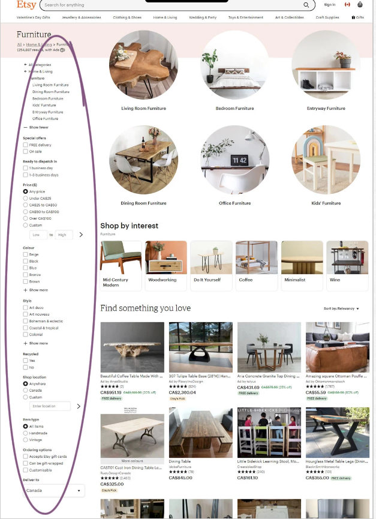
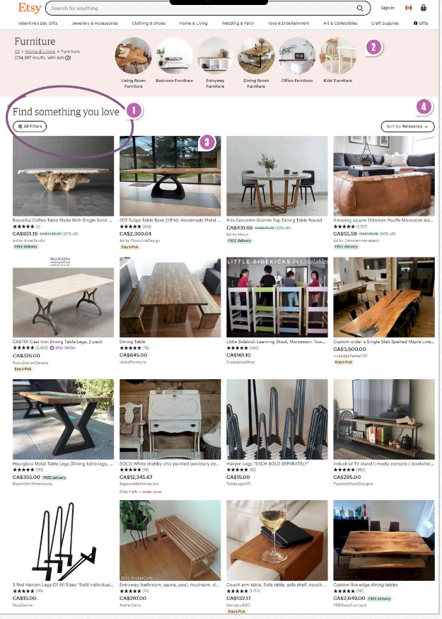
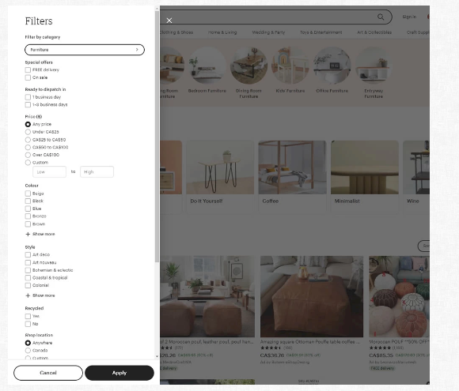
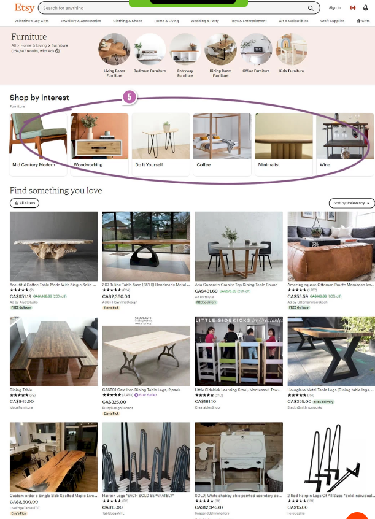

```{r setup, include=FALSE}
knitr::opts_chunk$set(echo = TRUE,
                      cache = TRUE, 
                      warning = FALSE,
                      message = FALSE)

```

### Summary


{width=40%}


{width=40%}
{width=40%}

{width=40%}

Etsy the global online market place, ran a filter experiment on their listing pages. Below you will see an example of the control and then the two other versions they tested.

Version B contained (1) collapsed and slide out filters (see below), (2) had condensed categories, (3) larger and higher product titles, and (4) more visible sorting.

The third version of the page contained an (5) exposed “shop by interest” which included things like “Mid Century Modern”, “Woodworking”, etc.

The test ran over a course of two weeks in March 2020. Randomization lead to 45,000 visits to the Control landing page and 44,800 to the Test landing page.  The analysis results show that there is only a 7% chance that the true success rate for the Test version is greater than the true success rate for the Control version.  


### Analysis

```{r, echo=FALSE}
df<-read.csv("/Users/jacobigel/Desktop/School/ISA365-A/Datasets/etsy_test.csv", stringsAsFactors = TRUE)

df$X <- as.factor(df$X)

head(df)

```


```{r}

library(magrittr) # needs to be run every time you start R and want to use %>%
library(dplyr)    # alternatively, this also loads %>%
df %>% group_by(Version, Purchase) %>% summarise(n=n()) %>% mutate(freq=n/sum(n)) %>% filter(Purchase > 0)


```
```{r}

dff <- filter(df, Purchase >0)
ggplot(df,aes(x=Version, y=Purchase))+geom_violin()+theme_bw()

```

```{r}

test<-chisq.test(table(df$Version, df$Purchase), correct = FALSE)
test

```
```{r}
test$expected
```

```{r}
test$observed
```
```{r}
test$residuals
```


```{r}
mod<-aov(Purchase~Version, data=df)
summary(mod)

```

```{r}
TukeyHSD(mod)
```

